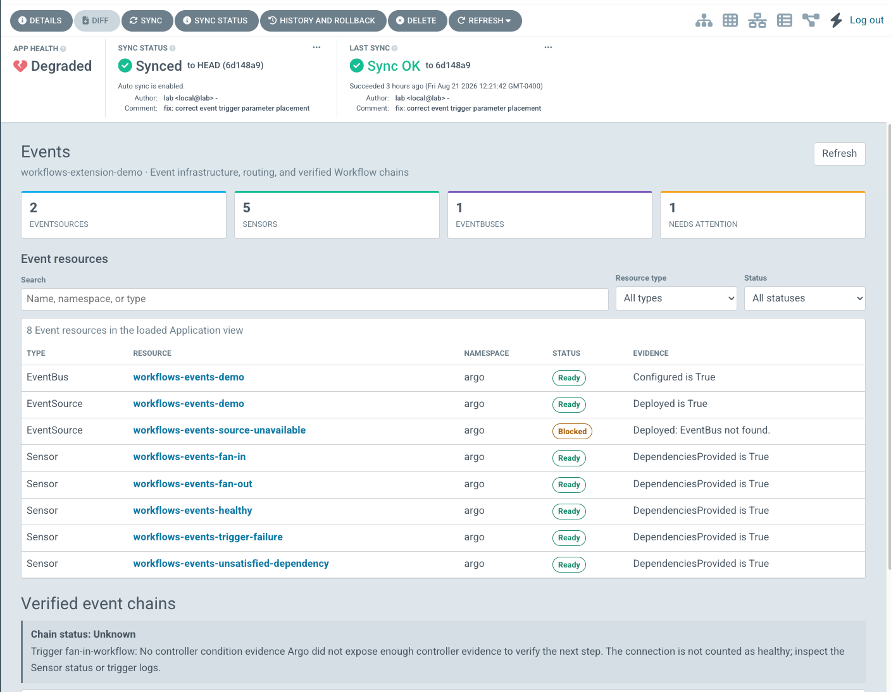
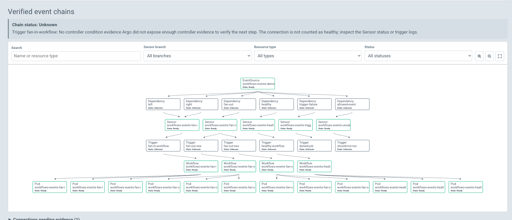
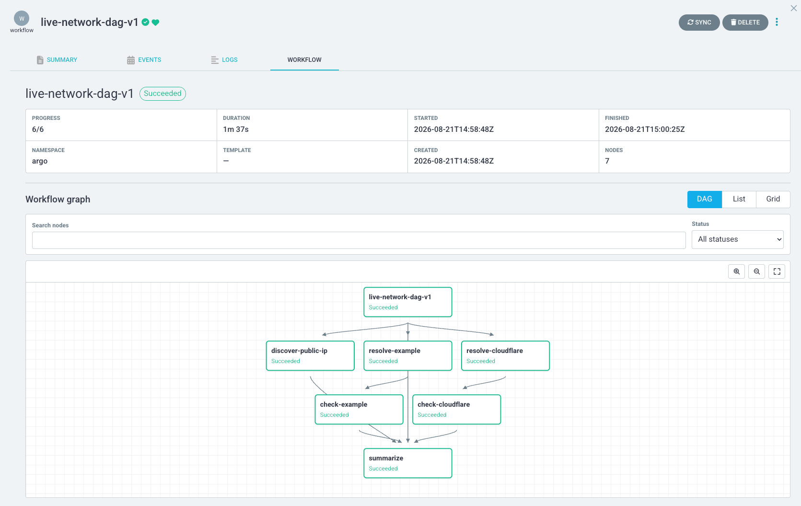
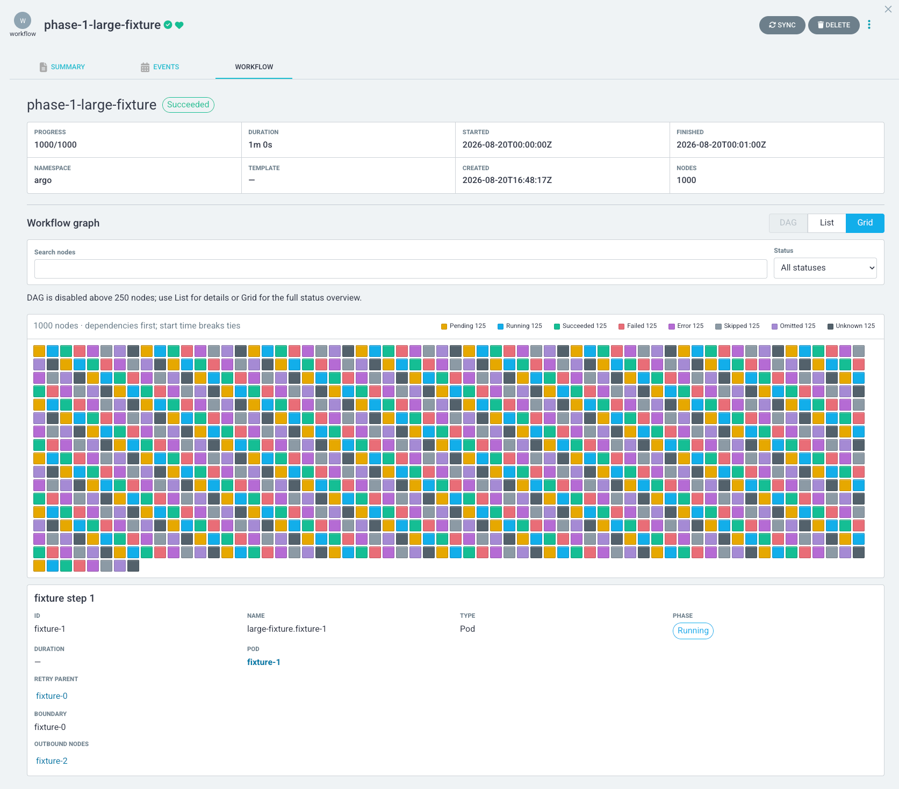
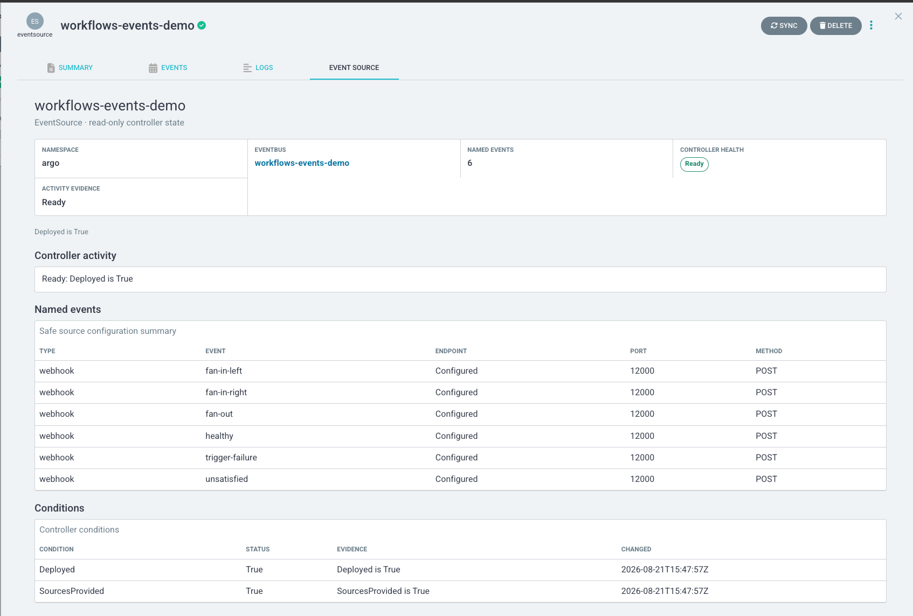
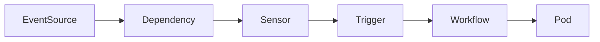
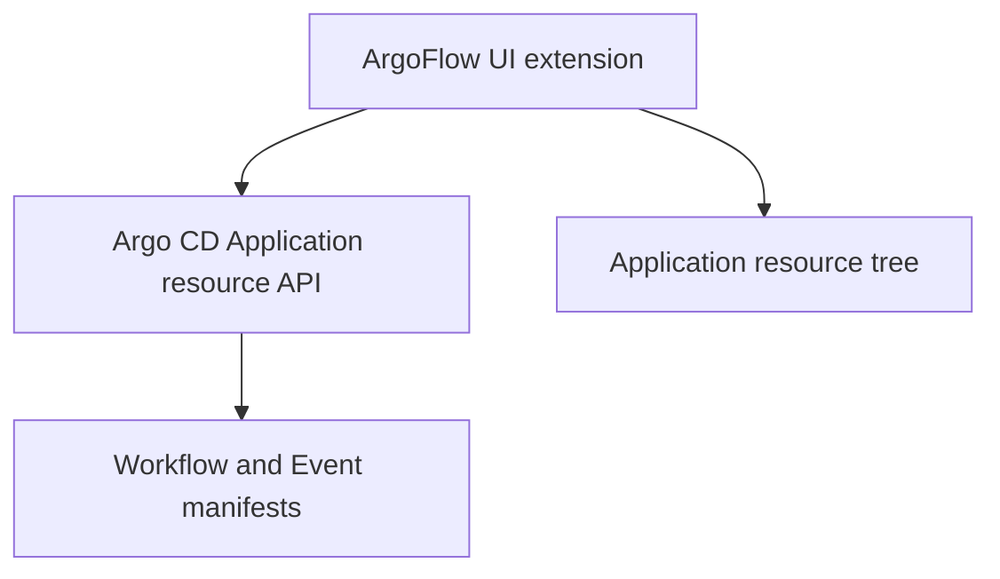

<h1 align="center">ArgoFlow</h1>

<p align="center">
  <strong>Workflows and Events inside Argo CD.</strong>
</p>

<p align="center">
  A read-only Argo CD UI extension for exploring Argo Workflows, Argo Events, DAGs, and verified event chains without leaving the Application view.
</p>

<p align="center">
  
  <a href="LICENSE"></a>
  <a href="https://github.com/nickmaccarthy/ArgoFlow/actions/workflows/ci-release.yml"></a>
  <a href="https://github.com/nickmaccarthy/ArgoFlow/releases"></a>
</p>

Argo CD shows which Kubernetes resources belong to an Application. ArgoFlow adds the automation story: which event arrived, which Sensor consumed it, which trigger created a Workflow, and what happened inside that Workflow.

No separate UI. No new backend. No BS.


## Screenshots

### Events overview

Application-scoped EventSources, Sensors, EventBuses, health evidence, and verified chains in one view.



### Verified event chain

Filterable EventSource → Sensor → Workflow → Pod relationships, built only from direct evidence.



### Workflow DAG

Searchable Workflow topology with status filtering, zoom, pan, and fit controls.



### Large Workflow grid

Bounded, color-coded status inspection for Workflows too large for a useful DAG.



### EventSource detail

Safe EventSource configuration, controller activity, named events, and condition evidence.



## Why ArgoFlow?

When using workflows events I found myself bounching between two differnt UI's, ArgoCD and Argo Worfkow.  The Argo Workflows UI leaves alot be desired and the disconnect made troubleshooting things very difficult, so I made ArgoFlow which bring it into one Application-scoped experience.

- See recent Workflow runs managed by an Application.
- Explore Workflow DAGs with search, status filters, zoom, pan, and fit controls.
- Inspect `Workflow`, `WorkflowTemplate`, and `CronWorkflow` resources.
- Review `EventSource`, `Sensor`, and `EventBus` controller state.
- Follow verified EventSource → Sensor → Workflow → Pod relationships.
- Distinguish healthy, active, blocked, failed, unknown, stale, and partial states.
- Navigate directly to related Argo CD resources.
- Keep existing Argo CD authentication, RBAC, and Application boundaries.

## What it looks like

### Application views

| View | Purpose |
| --- | --- |
| **Workflows** | Browse bounded live Workflow runs, filter by status and lifecycle, and open the selected run. |
| **Events** | Review Event infrastructure, health evidence, verified chains, and paths needing more evidence. |

### Resource tabs

| Resource | ArgoFlow experience |
| --- | --- |
| `Workflow` | Summary, DAG, list, dense status grid, filters, and node details. |
| `WorkflowTemplate` | Entrypoint definition graph and verified related runs. |
| `CronWorkflow` | Schedule, template context, controller status, and active children. |
| `EventSource` | Named events, safe routing summary, controller conditions, and downstream chain. |
| `Sensor` | Dependencies, trigger targets, controller evidence, and resulting Workflows. |
| `EventBus` | Implementation, controller health, and related Event resources. |

## Verified event chains

ArgoFlow correlates resources only when loaded configuration or controller metadata provides direct evidence.



Every displayed edge is verified. Expected links that cannot be proven are omitted from the graph and shown under **Connections needing evidence**. Unknown never silently becomes healthy or failed.

The graph supports:

- Sensor-branch filtering
- Resource-type and status filtering
- Text search
- Zoom, pan, and fit-to-view
- Keyboard-selectable cards
- In-graph details that remain open during data refreshes
- Direct links back to Argo CD resources

## Architecture

ArgoFlow is a client-side Argo CD UI extension.



- React comes from the Argo CD host and is not bundled.
- Reads use Argo CD's same-origin, Application-scoped resource API.
- Related Event reads use exact identities from the Application tree.
- No direct browser connection to Kubernetes or the Workflow Archive API.
- No service, controller, CRD, or database is added.

## Installation

### Requirements

- Argo CD `>=2.13.4, <3.5`
- Argo Workflows resources in the Argo CD Application tree
- Argo Events resources for Event views and event-chain correlation
- Node.js and npm when building from source

### Build from source

```bash
git clone https://github.com/nickmaccarthy/ArgoFlow.git
cd ArgoFlow
npm ci
npm run check
```

The production bundle is written to:

```text
dist/extension-workflows.js
```

### Load the extension in Argo CD

Mount the built JavaScript file into every `argocd-server` Pod under `/tmp/extensions`. The deployed filename must begin with `extension` and end with `.js`:

```text
/tmp/extensions/extension-argoflow.js
```

Restart or roll out `argocd-server`, hard-refresh Argo CD, then open an Application. **Workflows** and **Events** appear beside the standard Application views; supported resources gain their own tabs.

See Argo CD's [UI extension documentation](https://argo-cd.readthedocs.io/en/stable/developer-guide/extensions/ui-extensions/) for the supported bundle-loading contract.

### Install with the Argo CD Helm chart

The Argo CD Helm chart has built-in support for the Argo CD extension installer. Pin the ArgoFlow version rather than using a mutable `latest` URL:

```yaml
server:
  extensions:
    enabled: true
    extensionList:
      - name: extension-argoflow
        env:
          - name: EXTENSION_NAME
            value: argoflow
          - name: EXTENSION_URL
            value: https://github.com/nickmaccarthy/ArgoFlow/releases/download/v1.0.0/extension.tar.gz
          - name: EXTENSION_CHECKSUM_URL
            value: https://github.com/nickmaccarthy/ArgoFlow/releases/download/v1.0.0/extension_checksums.txt
```

Apply the values through your existing Argo CD Helm release, then wait for `argocd-server` to roll out. Change all three version references when upgrading.

### Install with Kustomize

Add this strategic-merge patch to the overlay that installs Argo CD:

```yaml
apiVersion: apps/v1
kind: Deployment
metadata:
  name: argocd-server
spec:
  template:
    spec:
      initContainers:
        - name: extension-argoflow
          image: quay.io/argoprojlabs/argocd-extension-installer:v1.0.1
          env:
            - name: EXTENSION_NAME
              value: argoflow
            - name: EXTENSION_URL
              value: https://github.com/nickmaccarthy/ArgoFlow/releases/download/v1.0.0/extension.tar.gz
            - name: EXTENSION_CHECKSUM_URL
              value: https://github.com/nickmaccarthy/ArgoFlow/releases/download/v1.0.0/extension_checksums.txt
          volumeMounts:
            - name: extensions
              mountPath: /tmp/extensions/
          securityContext:
            runAsNonRoot: true
            runAsUser: 1000
            allowPrivilegeEscalation: false
            capabilities:
              drop:
                - ALL
      containers:
        - name: argocd-server
          volumeMounts:
            - name: extensions
              mountPath: /tmp/extensions/
      volumes:
        - name: extensions
          emptyDir: {}
```

Reference it from your existing `kustomization.yaml`:

```yaml
patches:
  - path: argoflow-extension-patch.yaml
```

If your Argo CD Deployment or server container uses a different name, update both `argocd-server` fields. For production, pin the installer image by digest. Remove the patch or Helm `extensionList` entry to uninstall ArgoFlow.

### Local development lab

The included installer expects the companion `local-k8s-cluster` repository at `../../../local-k8s-cluster`, or at `LOCAL_K8S_CLUSTER_DIR`:

```bash
npm run install:local
```

It builds the bundle, installs one versioned extension file, applies the Argo CD Helmfile release with the explicit `colima` context, and waits for `argocd-server` to roll out.

Rollback the local bundle with:

```bash
npm run uninstall:local
```

## Security model

ArgoFlow is intentionally read-only.

- No Workflow submission, retry, suspend, resume, terminate, or deletion.
- No Event submission or EventBus administration.
- No namespace-wide browser queries.
- No cross-Application aggregation.
- No logs, artifacts, secret values, or Workflow parameters displayed.
- Controller messages pass through bounded redaction before rendering.
- Authentication and authorization failures remain distinct from empty results.
- Operational telemetry contains only feature names, states, durations, and numeric counts.

Event-chain loading is capped at 25 exact manifests and six concurrent workers. Graph rendering is capped at 100 cards, with a bounded list fallback. Workflow DAGs use a 250-node budget; larger Workflows open in scalable list/grid views.

See [ADR 0003](docs/adr/0003-phase-1c-scale-and-paging-boundary.md) for the server-side paging and archive boundary.

## Compatibility

Supported contract: Argo CD `>=2.13.4, <3.5`.

Interactive verification currently covers:

| Argo CD | Argo Workflows | Argo Events | Result |
| --- | --- | --- | --- |
| 2.13.4 | 3.7.4 | 1.9.11 | Verified |
| 3.4.6 | 3.7.4 | 1.9.11 | Verified |

This range is a compatibility contract, not a claim that every intermediate Argo CD release has been tested.

## Development

```bash
npm ci
npm run check
```

`npm run check` runs:

- TypeScript checking
- Production Webpack build
- Dependency-license validation
- Deterministic large-fixture validation
- Node test suite

Useful paths:

```text
src/                         Extension source
test/                        Model, UI-contract, scale, and security tests
docs/adr/                    Architecture decisions
docs/screenshots/            Compatibility and release evidence
scripts/                     Local install and fixture tooling
dist/extension-workflows.js  Production bundle
```

## Project status

ArgoFlow is a working v1 proof of concept. Current implementation has been exercised against real Workflow and Event resources, including healthy, blocked, failed, unknown, fan-in, fan-out, stale, partial, permission-limited, and large-Workflow scenarios.

Before the first public release:

- Add public contribution and security-reporting guides.

## Roadmap

- Easier installation and upgrades
- Additional event-chain filters and layouts
- Broader compatibility automation
- Optional archive integration through an explicitly authorized proxy
- Community-driven support for more Argo resource relationships

Mutating Workflow or Event controls are deliberately out of scope unless the security and authorization model changes.

## Contributing

Issues, UX feedback, compatibility reports, and pull requests are welcome. For behavioral changes:

1. Keep the extension read-only and Application-scoped.
2. Preserve truthful unknown, partial, and permission states.
3. Add the smallest regression test that proves the behavior.
4. Run `npm run check` before opening a pull request.

## Releases

Merges to `main` run the full check suite and [semantic-release](https://semantic-release.gitbook.io/semantic-release/). Conventional Commit messages determine the next version (`fix:` patch, `feat:` minor, and `BREAKING CHANGE:` major). Each release creates a Git tag and GitHub Release with a ready-to-install `extension-argoflow-vX.Y.Z.js` bundle attached. This project does not publish to npm.

## License

Copyright 2026 Nicholas MacCarthy. Licensed under the [Apache License 2.0](LICENSE).

## Release evidence

- [Current 0.4.0 evidence](docs/release-evidence-0.4.0.md)
- [Release evidence template](docs/release-evidence-template.md)
- [Product requirements](docs/argo-cd-workflows-events-extension-prd.md)

## Troubleshooting

- **No ArgoFlow views:** hard-refresh the browser, confirm the `argocd-server` rollout completed, and verify exactly one enabled extension bundle exists under `/tmp/extensions`.
- **A chain stops at Unknown:** open **Connections needing evidence** and inspect the named Sensor or trigger. ArgoFlow will not invent an edge without direct evidence.
- **Some resources are missing:** confirm they belong to the same Argo CD Application and that the current user can read them through Argo CD.
- **Large Workflow opens as a list:** expected above the 250-node DAG budget; use List or Grid for bounded rendering.
- **Build fails:** run `npm ci`, then rerun `npm run check` and inspect the first failing gate.
