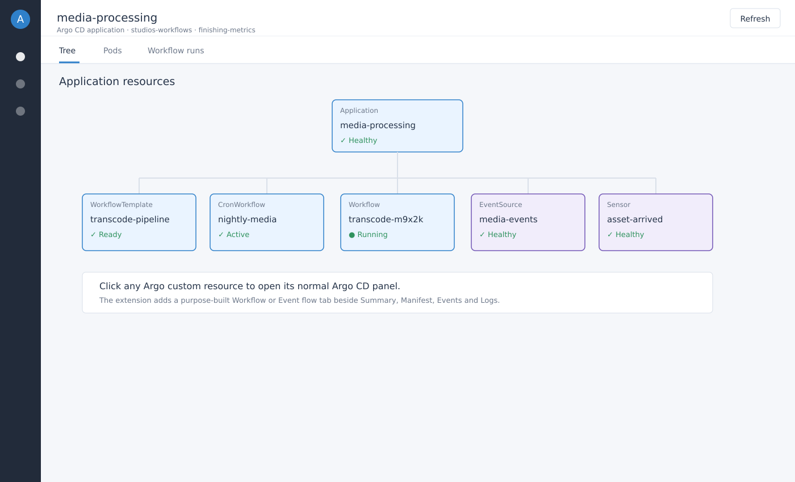
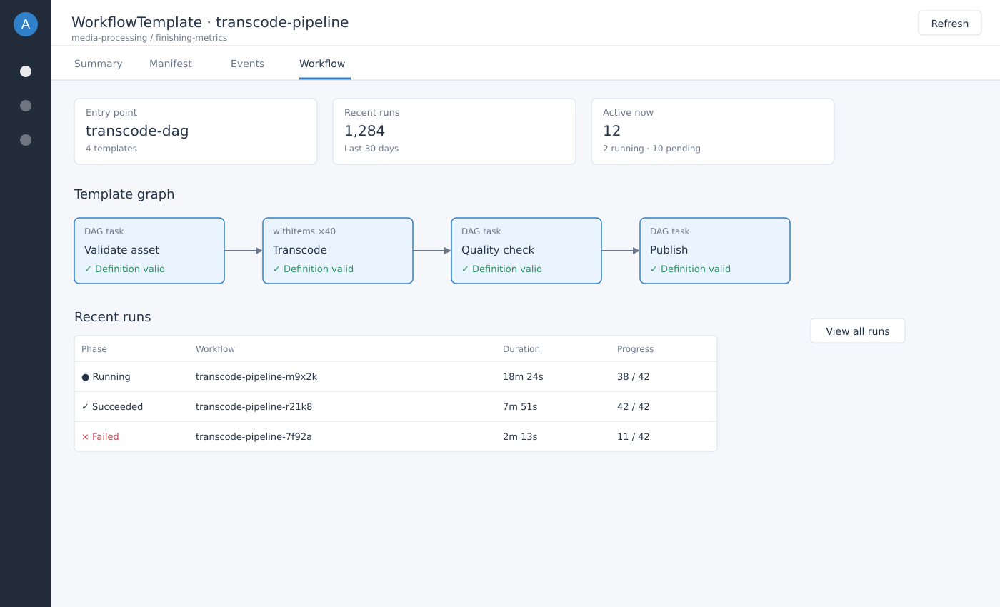
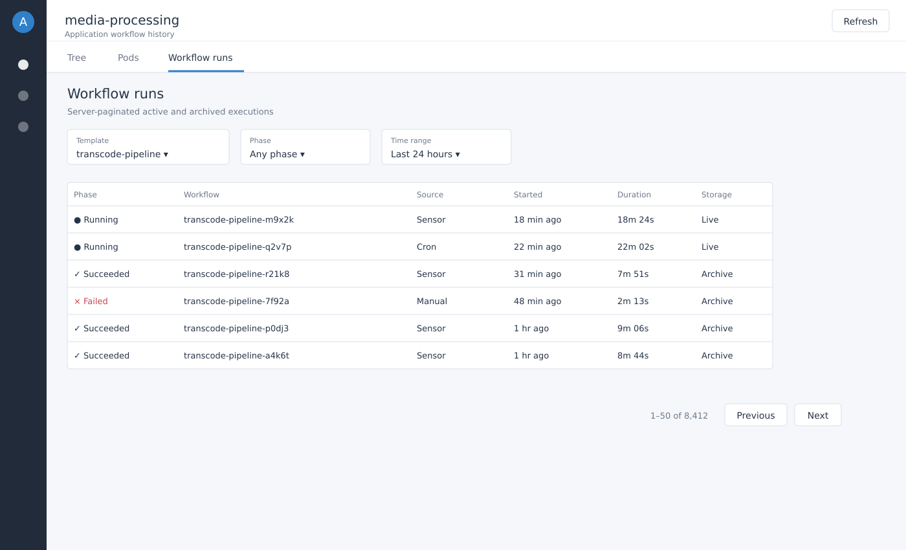
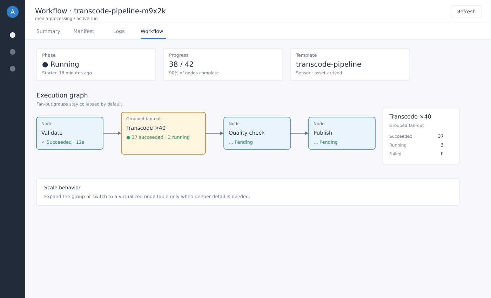
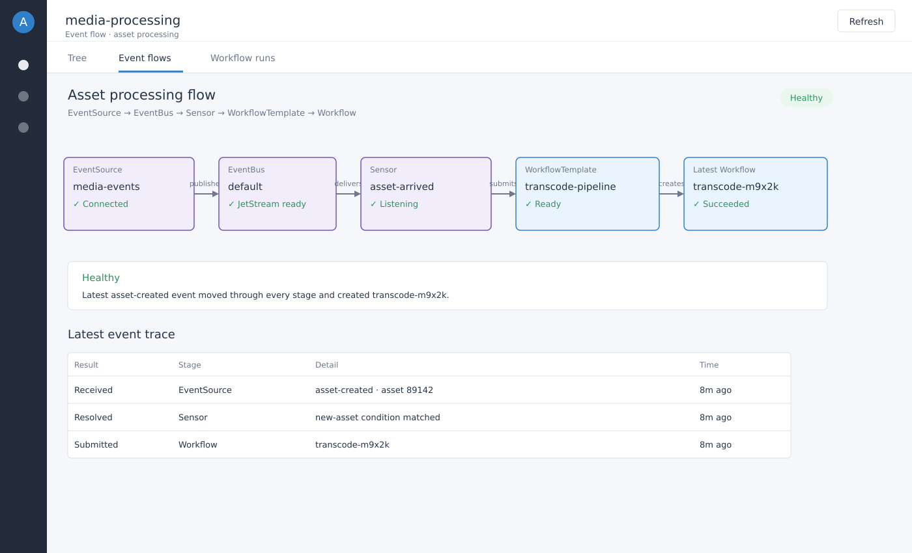
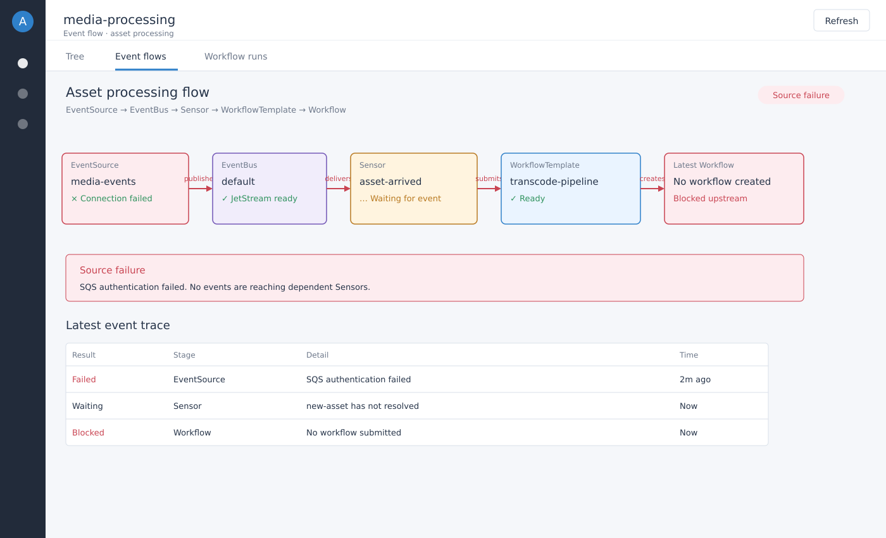
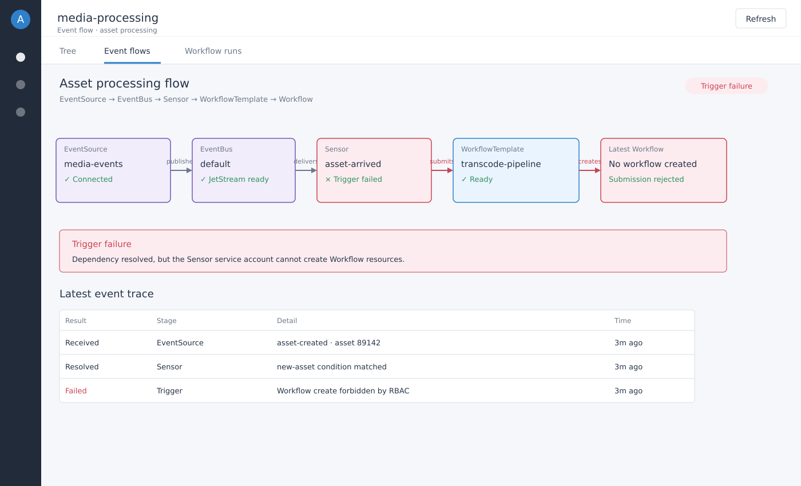
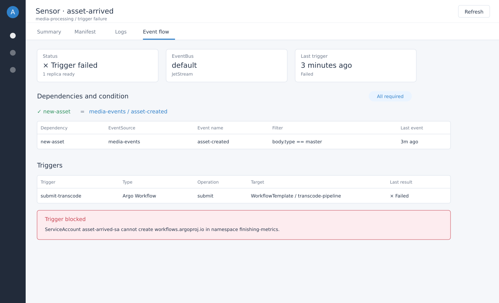
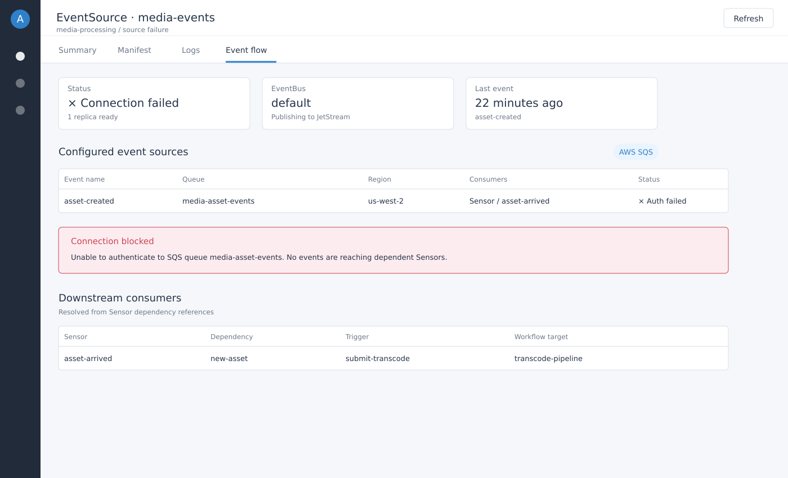

# Argo CD Workflows and Events Extension

> Product Requirements Document — Phase 1 accepted; Phase 2 ready for implementation

| Field | Value |
|---|---|
| Target platform | Argo CD `>=2.13.4, <3.5`; tested endpoints 2.13.4 and 3.4.6 |
| Delivery plan | Phase 1: Workflows accepted locally; Phase 2: Events next |
| Primary audience | SRE/platform engineers, application operators, contributors, and implementation agents |
| Last updated | August 21, 2026 |

Phase 1 is accepted as the UI, host-contract, data-boundary, and verification baseline. Phase 2 execution is defined in [the Phase 2 execution plan](./phase-2-execution-plan.md) and agent-ready tickets under `.scratch/argo-cd-events-phase-2/issues/`.

## Product outcome

A user can remain inside an Argo CD Application, click an Argo Workflow or Events resource, understand its state and relationships, and diagnose where execution is blocked without losing Argo CD project and application context.

## 1. Executive summary

Argo CD already gives teams a trusted application inventory, resource tree, RBAC boundary, and operational entry point. Argo Workflows and Argo Events expose the runtime information users need, but their separate web interfaces fragment the experience and are difficult to use at high run volumes. This extension will add focused workflow and event observability to Argo CD while preserving Argo CD as the shell and source of application context.

The product will be delivered in two phases. Phase 1 establishes a production-worthy workflow experience, beginning with a narrow resource-tab proof of concept and expanding to application-level run discovery. Phase 2 adds EventSource and Sensor details plus a correlated EventSource-to-Sensor-to-Workflow chain. The extension is observational by default; failed workflow runs do not automatically degrade the Argo CD Application.

### 1.1 Product principles

1. **Native before novel.** Reuse Argo CD placement, interaction patterns, colors, typography, icons, panels, status semantics, and shared Argo UI components where suitable.
2. **Application context is the boundary.** Users should see only resources they are authorized to see through the selected Argo CD Application and approved proxy paths.
3. **Fast at high cardinality.** Never require loading every workflow or archived run to render the first screen.
4. **Observe before acting.** The first release focuses on understanding state; retries, termination, resubmission, and other mutations are deferred.
5. **Truthful correlation.** The UI must distinguish verified relationships from inferred or unresolved relationships.
6. **Compatibility over cleverness.** Do not import private Argo CD UI source modules. Isolate shared-library dependencies behind local adapters and test explicitly against Argo CD 2.13.4 and 3.4.6.

### 1.2 Success definition

**Phase 1 succeeds when:** an operator can install one extension bundle, click a Workflow resource in an Argo CD Application, and obtain a usable, responsive DAG and node details without leaving Argo CD. The completed phase also exposes a paginated application-level runs view without browser slowdown at production-scale history.

**Phase 2 succeeds when:** an operator can click an EventSource or Sensor and see its configuration, current health, dependencies, triggers, and the verified path to related Workflow executions, including a clear indication of the component blocking delivery.

## 2. Problem statement

Operators currently move between Argo CD, Argo Workflows, and Argo Events interfaces to answer basic questions: What launched this workflow? Is the sensor receiving events? Which trigger failed? Is a workflow still running or merely absent? This context switching is especially costly when many teams share clusters and users are already organized around Argo CD Projects and Applications.

The Argo CD Application resource tree already surfaces `Workflow`, `WorkflowTemplate`, `CronWorkflow`, `Sensor`, and `EventSource` custom resources when they are part of or discoverable beneath an Application. Clicking one should open a purpose-built operational view rather than requiring the user to inspect raw YAML or leave Argo CD.

### 2.1 Primary users

| User | Primary need | Expected behavior |
|---|---|---|
| Application operator | See whether a current run is progressing and why it failed. | Opens the Workflow from the application tree and inspects the DAG and failed node. |
| Developer | Understand which template and parameters produced a run. | Views the template reference, arguments, node inputs/outputs, and related runs. |
| Platform/SRE engineer | Diagnose event delivery and workflow launch failures. | Uses the event-chain view to locate the first unhealthy or blocked component. |
| Argo CD administrator | Provide visibility without bypassing tenancy controls. | Deploys one extension and, if required, an optional proxy with explicit RBAC and namespace boundaries. |

### 2.2 Core user stories

- As an application user, I can click a Workflow in the Argo CD resource tree and see its execution graph and status.
- As an application user, I can switch from a DAG to a scalable node list when a workflow contains hundreds or thousands of nodes.
- As an operator, I can select a failed node and see enough information to identify the failing template, pod, message, timing, and retry relationship.
- As an application user, I can browse recent workflow runs associated with the Application without retrieving the entire history.
- As an operator, I can click a Sensor or EventSource and understand its dependencies, triggers, conditions, health, and recent activity.
- As an operator, I can see a verified EventSource-to-Sensor-to-Workflow chain and identify the first blocked or unhealthy hop.

## 3. Scope and delivery roadmap

| Increment | Outcome | Included | Explicitly excluded |
|---|---|---|---|
| Phase 1A: Workflow POC | Prove extension loading and selected-resource rendering across the supported host contract. | Workflow resource tab, summary, DAG from `status.nodes`, node selection, list fallback. | History search, archive API, logs/artifacts, actions, Events. |
| Phase 1B: Workflow v1 | Provide the useful day-to-day workflow experience. | WorkflowTemplate/CronWorkflow context, Application runs view, pagination, filters, loading/error/empty states. | Mutating operations and cross-application aggregation. |
| Phase 1C: Scale hardening | Remain responsive for large workflows and large run histories. | Virtualization, incremental graph rendering, server-side paging, performance budgets, telemetry. | Unbounded client-side watches or cluster-wide lists. |
| Phase 2: Events | Expose EventSource/Sensor state and correlate the end-to-end launch chain. | Resource tabs, chain view, blocked-hop diagnosis, verified workflow links, event-specific states. | Generic EventBus administration and destructive actions. |

### 3.1 Global non-goals for the first two phases

- Replacing the complete Argo Workflows or Argo Events administrative UI.
- Allowing users to edit arbitrary CR YAML from the extension.
- Automatically marking an Argo CD Application `Degraded` because a historical or runtime Workflow failed.
- Creating a new identity, authorization, or tenancy model independent of Argo CD.
- Displaying every run from every namespace or cluster in one global dashboard.
- Depending directly on private Argo CD React components or internal source paths.

## 4. Phase 1 — Argo Workflows

### 4.1 Entry points

| Entry point | Registration/placement | When shown | Purpose |
|---|---|---|---|
| Workflow resource tab | `registerResourceExtension` for `argoproj.io/Workflow` | Whenever a Workflow resource drawer opens. | Primary POC and per-run detail experience. |
| WorkflowTemplate resource tab | Resource extension for `WorkflowTemplate` | When the resource exists in the Application tree. | Template definition, DAG/steps preview, parameters, and related runs. |
| CronWorkflow resource tab | Resource extension for `CronWorkflow` | When the resource exists in the Application tree. | Schedule, suspension, last/next activity, template, and recent runs. |
| Application Workflows view | `registerAppViewExtension` | Only when supported Argo Workflow resources are present or configured. | Paginated recent runs and operational summary scoped to the Application. |

### 4.2 Phase 1A POC functional requirements

- **P1A-01:** Register a resource extension matching group `argoproj.io` and kind `Workflow` at both tested Argo CD endpoints.
- **P1A-02:** Render from the Application, resource, and tree props supplied by Argo CD. The POC must not require a separate backend.
- **P1A-03:** Show name, namespace, phase, progress, creation/start/finish times, duration, WorkflowTemplate reference when present, and the most useful status message.
- **P1A-04:** Build a workflow graph from the selected resource's `status.nodes` and relevant spec/template information. Preserve dependency direction and node hierarchy.
- **P1A-05:** Map node states consistently: Pending, Running, Succeeded, Failed, Error, Skipped, Omitted, and unknown/unrecognized.
- **P1A-06:** Clicking a graph node opens a detail region showing node name/display name, type, phase, message, started/finished/duration, template name/reference, pod name, retry parent/children, and available inputs/outputs metadata.
- **P1A-07:** Provide a node list view with search and status filtering. The list is mandatory because very large DAGs may be faster to diagnose as rows.
- **P1A-08:** Display deliberate loading, missing-data, unsupported-schema, and render-failure states; never fall back to a blank panel.
- **P1A-09:** Read-only behavior. No retry, terminate, suspend, resume, resubmit, delete, or edit controls in the POC.
- **P1A-10:** Failed Workflow or node status is visible within the extension but does not modify Argo CD Application health.

### 4.3 Workflow resource experience

The Workflow tab opens on a concise summary followed by the primary DAG/list workspace. The initial viewport must answer: What is this run? Is it still moving? Where is the first failure? The selected-node panel preserves context instead of navigating away.

| Region | Required content | Interaction |
|---|---|---|
| Summary strip | Phase, progress, duration, started, template/reference, namespace. | Status uses an Argo-compatible icon/color plus text; never color alone. |
| View controls | DAG/List toggle, node search, status filters, fit/zoom controls. | Selection and filters persist while the drawer remains open. |
| DAG canvas | Dependency graph, grouped retries/steps where useful, critical failed/running states. | Pan, zoom, fit, keyboard-select nodes, and preserve readable labels. |
| Node list | Name, type, phase, duration, attempts, message. | Virtualized rows for large node counts; selecting a row selects the same node as the DAG. |
| Node details | Identity, lifecycle, pod/template linkage, message, inputs/outputs metadata. | Side or lower panel depending on available width. |

### 4.4 WorkflowTemplate and CronWorkflow experience

- **WorkflowTemplate:** show template type (DAG/steps/container), entrypoint, declared parameters, DAG/steps preview, references to other templates, and recent runs verified as originating from the template.
- `ClusterWorkflowTemplate` is a later-compatible target and is not required for initial Phase 1 acceptance unless explicitly enabled and authorized.
- **CronWorkflow:** show schedule, timezone, suspend state, concurrency policy, starting deadline, success/failure history limits, last scheduled time, and recent Workflow children.
- Do not imply that a template preview is an execution graph. Label unexecuted structure as **Template** and actual `status.nodes` as **Run**.

### 4.5 Application Workflows view and run discovery

The Application-level view is required for Workflow v1, but follows the resource-tab POC. It provides recent runs without crowding the Argo CD resource tree. The view must use server-side pagination or another bounded query mechanism when Argo CD does not already hold the necessary run set.

- Default to recent active and recently completed runs, sorted newest first.
- Offer filters for status, name/template, namespace when relevant, active/completed, and time range.
- Clearly distinguish live Kubernetes Workflow resources from archived Workflow records.
- Never load thousands of complete Workflow objects into browser memory merely to produce counts or the first page.
- Use stable pagination/cursors and a fast default page size; start with 25–50 rows.
- When a run cannot be verified as belonging to the selected Application, omit it or label the relationship as unverified according to the correlation rules.

### 4.6 Workflow health behavior

> **Decision:** The extension is observational. A failed Workflow run does not, through extension logic, degrade the parent Argo CD Application in Phase 1. Health customization remains an independent Argo CD administrator decision.

The UI may summarize run state using labels such as “2 active and 1 failed,” but this summary must not masquerade as Argo CD Application Health. If Argo CD itself marks a managed Workflow `Degraded` through built-in or configured health assessment, the extension displays that fact without changing it. Documentation should note that administrators may use the `argocd.argoproj.io/ignore-healthcheck` annotation where appropriate.

### 4.7 Workflow performance requirements

| Scenario | Required behavior | Initial target |
|---|---|---|
| Normal Workflow | Render summary and usable graph promptly. | Up to 250 nodes without virtualization artifacts. |
| Large Workflow | Prefer progressive graph construction and always keep the list usable. | 1,000+ nodes without freezing the main UI thread for sustained periods. |
| Very large Workflow | Warn when full DAG visualization is expensive; default or offer list-first mode. | Several thousand nodes remain diagnosable through a virtualized list. |
| Large run history | Fetch one bounded page and summary counts independently. | Thousands of historical runs do not increase the initial payload linearly. |

These are initial design targets, not claims about current Argo components. The implementation agent must establish repeatable performance fixtures and record measured browser timings before release.

## 5. Phase 2 — Argo Events

### 5.0 Execution baseline

Phase 2 reuses the completed Phase 1 extension, UI language, graph geometry, Argo resource links, same-origin Application API loader, six-request concurrency cap, state semantics, scoped themes, error boundaries, installer, and browser verification loop. It does not repeat host-contract discovery or introduce a separate design system.

The first vertical slice is a real local chain on `colima`: webhook EventSource → Sensor dependency/trigger → generated Workflow → child Pods. Local implementation targets Argo Events 1.9.11 and Argo Workflows 3.7.4. Resource tabs, correlation, and chain rendering are developed against that live evidence plus deterministic failure/fan-in/fan-out fixtures.

Phase 2 runs as one goal using [the execution plan](./phase-2-execution-plan.md). Internal tickets are checkpoints for agents, not user approval gates.

### 5.1 Entry points and resource details

| Resource | Resource-tab content | Primary question answered |
|---|---|---|
| EventSource | Type, endpoint/source configuration summary, event names, EventBus reference, status/conditions, recent observable activity where available. | Is the source configured and able to receive or emit events? |
| Sensor | Dependencies, dependency conditions, filter summary, triggers, trigger policy, status/conditions, related Workflows. | Did dependencies resolve, and did the trigger launch its target? |
| EventBus | Name/reference and connection health only where safely available. | Is the shared transport an identified blocker? |

### 5.2 Event-chain view

The distinguishing Phase 2 capability is a correlated operational chain rather than isolated CR viewers. For a selected Application or supported resource, show the relevant EventSource event, Sensor dependency/condition, trigger, and Workflow execution as a compact top-down or left-to-right path. The chain must remain readable when one source feeds multiple sensors or one sensor has multiple triggers.

- **P2-01:** Parse Sensor dependencies and match `eventSourceName` and `eventName` to EventSource definitions in the authorized Application scope.
- **P2-02:** Parse Sensor triggers and identify Argo Workflow, WorkflowTemplate, or Kubernetes-object trigger targets.
- **P2-03:** Link a triggered Workflow only when labels, annotations, owner references, trigger metadata, or another documented identifier provides evidence. Do not rely solely on similar names.
- **P2-04:** Show the first blocked or unhealthy hop and a human-readable explanation: source unavailable, dependency unsatisfied, condition false, trigger error, Workflow not created, Workflow running, or Workflow failed.
- **P2-05:** A missing runtime signal must be shown as `Unknown` or `No recent evidence`, not as `Healthy`.
- **P2-06:** Provide resource links back to the existing Argo CD node/drawer where possible.
- **P2-07:** Support fan-in dependencies and fan-out triggers without forcing every branch into one unreadable horizontal row.
- **P2-08:** Event failures are visible in the extension but do not alter parent Application health through extension logic in Phase 2.

### 5.3 Chain state semantics

| State | Meaning | Visual treatment |
|---|---|---|
| Healthy/Ready | Configuration and available runtime conditions indicate readiness. | Green icon plus explicit text. |
| Active/Processing | An event, dependency, trigger, or Workflow is currently progressing. | Blue active indicator with text. |
| Blocked | A prerequisite is known not to be satisfied. | Amber indicator and reason at the first blocked hop. |
| Failed/Error | A component reports a terminal or actionable error. | Red indicator, message, and resource link. |
| Unknown | The extension lacks sufficient evidence or access. | Neutral gray; explain missing evidence or permission. |

## 6. Correlation and Application-scoping rules

Correlation is both a product feature and a security boundary. Every relationship displayed by the extension must carry a confidence category internally, even if the UI uses simpler language.

| Category | Evidence | UI behavior |
|---|---|---|
| Verified | Direct spec reference, `ownerReference`, Argo tracking metadata, controller-provided label/annotation, or exact trigger-generated identifier. | Display a solid link and permit navigation. |
| Inferred | Multiple weaker signals such as namespace, `templateRef`, generated-name prefix, and timing agree. | Optional dashed link labeled `Inferred`; never count as guaranteed. |
| Unresolved | Insufficient or conflicting evidence. | Do not draw a definitive edge; explain what could not be resolved. |

- Start with resources already present in the Argo CD Application tree and selected Application context.
- For proxy queries, constrain cluster, namespace, Argo CD Project/Application, resource kind, and requested fields as tightly as possible.
- Never expose a run merely because it shares a namespace with the Application when the namespace is multi-tenant.
- Treat archived workflows as a separate data source with the same Application-correlation requirement.
- Surface incomplete RBAC as an explicit permission-limited state rather than an empty-success state.

## 7. UX and visual design requirements

### 7.1 Native Argo CD behavior

- Use Argo CD resource tabs, app views, flyouts, spacing, typography, icons, status colors, form controls, and density as the baseline.
- Reuse the shared Argo UI component package selectively for standard controls. Wrap external/shared components behind local `Button`, `Tabs`, `StatusBadge`, `Table`, `EmptyState`, and `Drawer` adapters.
- Do not import private modules from the Argo CD UI source tree; they are not a stable extension API.
- The host provides React. Configure bundling so React and any host-provided runtime globals required by the target Argo CD version are externalized.
- Adapt or reuse Apache-licensed Argo Workflows DAG concepts/code only after documenting the source, license obligations, dependency impact, and compatibility strategy. A copied implementation must be maintainable independently.

### 7.2 Mockups as normative direction

> **Instruction to implementation agents:** The mockups in Appendices A and B are the visual target for information hierarchy, density, placement, and interactions. They are not permission to invent a separate design system. Match them using Argo CD/Argo UI conventions and reusable local adapters; preserve existing Argo CD chrome rather than recreating it inside the extension.

- Implement the Workflow resource detail before the broader runs browser.
- Preserve the DAG/list toggle and selected-node detail model shown in the Workflow mockups.
- Preserve the event-chain emphasis and first-blocked-hop diagnosis shown in the Event mockups.
- Use the same status meaning across summary cards, graph nodes, tables, filters, and detail panels.
- If technical constraints require a visible deviation, document it in the PR with before/after screenshots and rationale.

### 7.3 Accessibility and resilience

- All statuses must include text or an icon label; color alone is insufficient.
- DAG nodes, view toggles, filters, rows, and detail controls must be keyboard accessible with visible focus.
- Provide accessible names for graph nodes and status icons.
- Support Argo CD light and dark themes without global CSS overrides.
- Constrain all extension CSS to an extension root to prevent style leakage into Argo CD.
- Every query surface has loading, empty, partial, error, stale-data, and permission-denied behavior.

## 8. Technical architecture

### 8.1 Component model

| Component | Responsibility | Phase |
|---|---|---|
| UI extension bundle | Register resource/application extensions, render views, manage bounded client state, and consume Argo CD props. | 1 and 2 |
| Local UI adapter layer | Insulate product components from `argo-ui` and host-runtime changes. | 1 |
| Workflow parser/model | Normalize Workflow spec/`status.nodes` into summary, graph, list, and node-detail models. | 1 |
| Optional Argo CD proxy extension | Perform authorized bounded queries for recent/live/archived runs and later event-related data not present in the resource tree. | 1B and 2 |
| Event correlation engine | Normalize EventSource/Sensor specs and resolve verified/inferred relationships. | 2 |

### 8.2 Data-source hierarchy

1. Selected resource and Application tree props supplied to the UI extension.
2. Existing Argo CD APIs already authorized for the Application and exposed through supported extension mechanisms.
3. An Argo CD proxy extension to Argo Workflows/Events or Kubernetes APIs, with strict upstream, header, verb, resource, and scope controls.

Archive access is optional and feature-detected. The UI must function when Workflow Archive is not configured. The browser must not receive cluster credentials or independently authenticate directly to the Kubernetes API.

### 8.3 Repository and build expectations

- Standalone open-source repository modeled operationally after [`argoproj-labs/rollout-extension`](https://github.com/argoproj-labs/rollout-extension).
- TypeScript and React with a reproducible locked dependency graph.
- One documented production bundle plus source maps only where deployment policy permits.
- React and host-provided runtimes externalized for Argo CD compatibility; automated bundle inspection verifies they are not duplicated.
- Installation manifests support mounting extension JavaScript into `/tmp/extensions` on `argocd-server` without replacing the Argo CD image.
- A local development environment pins the tested Argo CD endpoints and representative Argo Workflows/Events versions in fixtures or containers.
- CI produces release artifacts, checks licenses, runs tests, and exercises installation against the supported matrix.

## 9. Security and authorization requirements

- **SEC-01:** The extension must not expand what an Argo CD user can discover beyond the user's authorized Applications, Projects, clusters, and namespaces.
- **SEC-02:** Any proxy extension must use an allowlisted upstream, verbs, paths, query parameters, and headers; arbitrary URL forwarding is prohibited.
- **SEC-03:** Server-side enforcement is required. Hiding a control or row in React is not authorization.
- **SEC-04:** Sensitive Workflow inputs, outputs, parameters, artifact locations, and messages may contain secrets or regulated data. The default UI should summarize and redact where appropriate, with raw views governed separately.
- **SEC-05:** Logs and artifacts are out of initial scope because they introduce streaming, storage credentials, retention, and content-sensitivity concerns.
- **SEC-06:** No mutating actions are enabled until a later security review defines authorization, confirmation, audit, and failure semantics.
- **SEC-07:** Dependencies and bundled assets must pass vulnerability and license checks before release.

## 10. Quality, test, and observability requirements

| Area | Minimum coverage |
|---|---|
| Unit tests | Workflow normalization, node/edge construction, phases, durations, retries, missing fields, Sensor/EventSource parsing, correlation confidence. |
| Component tests | Loading/empty/error/permission states, filters, DAG/list selection parity, accessible names, theme behavior. |
| Integration tests | Extension loads in Argo CD 2.13.4 and 3.4.6; supported CRs open the correct tabs; Application-scoped requests remain bounded. |
| Fixture tests | Succeeded, running, failed, errored, skipped, retried, DAG, steps, nested templates, very large Workflow, fan-in Sensor, fan-out Sensor, missing source, failed trigger. |
| Visual regression | Screens corresponding to every mockup at standard desktop width and both themes; deviations reviewed intentionally. |
| Performance | Measured render/query budgets using large fixtures; no unbounded lists or watches; browser remains interactive. |
| Operational telemetry | Extension/version load success, query latency/failure, render errors, payload/page size, and feature availability without recording sensitive workflow data. |

### 10.1 Supported-version policy

The compatibility contract is Argo CD `>=2.13.4, <3.5`; exact interactive endpoints are 2.13.4 and 3.4.6. This range is a host-contract commitment, not a claim that every intermediate version has been tested. The Phase 2 local baseline is Argo Events 1.9.11 and Argo Workflows 3.7.4; release evidence must record any broader tested range.

## 11. Release and deployment requirements

- Provide an install manifest and Helm/Kustomize-friendly example that copies a versioned extension bundle into the `argocd-server` extension directory.
- Pin releases by immutable version or digest; do not recommend floating `latest` in production.
- Document rollback as removal or reversion of the mounted extension artifact and `argocd-server` rollout.
- Feature-detect optional proxy/archive capabilities and degrade gracefully when absent.
- Publish a compatibility matrix, screenshots, security notes, known limitations, and upgrade notes with every release.
- Use semantic versioning and maintain a changelog. Pre-1.0 releases must still describe breaking installation or data-model changes prominently.

## 12. Acceptance criteria

### 12.1 Phase 1A POC exit criteria — accepted August 21, 2026

- [x] The extension installs and loads successfully at the tested Argo CD endpoints.
- [x] Opening an `argoproj.io/Workflow` resource shows the Workflow experience.
- [x] DAG, List, and Grid views cover failures, skipped nodes, retries, and shared selection.
- [x] Selecting the same node across views opens consistent details and Argo Pod links.
- [x] A 1,000-node fixture remains usable with bounded list/grid rendering.
- [x] The bundle externalizes React and scopes CSS.
- [x] Workflow status does not change Argo CD Application health through extension code.
- [x] README includes installation, rollback, compatibility, limitations, and development instructions.

### 12.2 Phase 1 complete exit criteria — accepted August 21, 2026

- [x] WorkflowTemplate and CronWorkflow resource experiences meet their specified content requirements.
- [x] The Application Workflows view returns bounded pages, paginates, filters, and states archive unavailability truthfully.
- [x] Application/run correlation follows documented verified/inferred/unresolved rules.
- [x] Authorization and permission-limited states are tested with separate Argo CD Projects and namespaces.
- [x] Performance fixtures demonstrate bounded behavior for large Workflows and histories.
- [x] Browser evidence covers Workflow experiences in light/dark themes and supported host endpoints.

### 12.3 Phase 2 complete exit criteria — accepted August 21, 2026

- [x] EventSource and Sensor tabs render required configuration and condition details.
- [x] EventBus renders its limited reference and available connection-health summary without administration controls.
- [x] The chain view represents healthy, source-failure, trigger-failure, blocked, and unknown cases.
- [x] Verified Workflow launches link to the corresponding Workflow resource experience.
- [x] Fan-in and fan-out fixtures remain readable and navigable.
- [x] The extension never labels absence of evidence as success and never crosses Application authorization boundaries.
- [x] Visual regressions cover all five Event mockups in Appendix B.

## 13. Build-agent handoff contract

> **Instruction to implementation agents:** Phase 1 is the working baseline. Execute Phase 2 through [the Phase 2 execution plan](./phase-2-execution-plan.md) and its tickets. Sol is the root orchestrator and final verifier; Terra/Luna perform bounded implementation, fixtures, tests, browser work, and intermediate reviews. Continue through safe local implementation and verification without ticket-by-ticket approval. Kubernetes access is restricted to context `colima`: run the plan’s preflight first, use explicit `kubectl --context colima` or `helmfile --kube-context colima` on every command, and stop rather than falling back to another context. Stop only at the plan’s explicit authority, correlation, cluster-safety, destructive-state, or repeated-environment-failure boundaries.

### 13.1 Required implementation sequence

1. Run the live event fixture and pure model/correlation work in parallel.
2. Build EventSource/Sensor tabs and the verified chain from settled model contracts, reusing Phase 1 UI and loaders.
3. Harden security, scale, incomplete evidence, accessibility, and fan-in/fan-out behavior.
4. Run one consolidated release gate across checks, Colima, browser, compatibility endpoints, evidence, and rollback.

### 13.2 Pull-request evidence required

- Requirement IDs implemented and intentionally deferred.
- Screenshots corresponding to the relevant appendix mockups.
- Argo CD and Argo Workflows/Events versions tested.
- Bundle contents showing host React is not duplicated.
- Unit/integration/visual/performance results and fixture sizes.
- Authorization analysis for every new query path.
- Known deviations, risks, and rollback instructions.

## 14. Decisions already made

| Decision | Rationale |
|---|---|
| Workflows precede Events. | Phase 1 proved extension loading, data modeling, graph behavior, UI compatibility, bounded requests, and live browser verification; Phase 2 reuses that work. |
| Phase 2 is one goal. | Tickets are internal agent checkpoints. Safe local work proceeds without repeated user approvals. |
| Real event chain first. | A live EventSource/Sensor/Workflow fixture resolves schema, RBAC, pod, and correlation assumptions earlier than mock-only UI work. |
| Read-only first. | Observability provides value without prematurely solving mutating RBAC, confirmation, and audit semantics. |
| Workflow failure does not automatically degrade the Application. | Runtime/history failures are not always equivalent to desired-state application degradation; health remains separately configurable. |
| Use Argo CD as the shell, not as an internal component SDK. | Supported extension points are stable enough for placement/data; private React internals are not a supported contract. |
| Bounded queries and list fallback are mandatory. | Large jobs may have hundreds or thousands of nodes and histories may contain thousands of runs. |
| Correlation must be evidence-based. | A visually convincing but incorrect event chain is worse than an explicit unknown state. |

## 15. Open questions to resolve during implementation

- Which Argo Events versions beyond the local 1.9.11 baseline require release support?
- Is Workflow Archive enabled in each environment, and what retention/query APIs are available?
- Which Argo Events 1.9.11 labels, annotations, owner references, and trigger identifiers survive on generated Workflows in the live fixture?
- Are Sensor-created Workflows visible in the Argo CD Application tree today, or will proxy discovery be required?
- What fields may contain sensitive production data and require default redaction?
- What measured node/run counts represent the 50th, 95th, and worst-case production workloads?
- Should `ClusterWorkflowTemplate` support be part of Phase 1 or a follow-up?

## 16. Authoritative references

- [Argo CD 3.4 UI Extensions](https://argo-cd.readthedocs.io/en/release-3.4/developer-guide/extensions/ui-extensions/)
- [Argo CD 3.4 Proxy Extensions](https://argo-cd.readthedocs.io/en/release-3.4/developer-guide/extensions/proxy-extensions/)
- [Argo CD Resource Health](https://argo-cd.readthedocs.io/en/release-3.4/operator-manual/health/)
- [Argo Project shared UI components](https://github.com/argoproj/argo-ui)
- [Argo Rollouts extension reference implementation](https://github.com/argoproj-labs/rollout-extension)
- [Argo Workflows source and UI](https://github.com/argoproj/argo-workflows)
- [Argo Events source](https://github.com/argoproj/argo-events)

## Appendix A — Workflow UI mockups

These mockups are normative for information hierarchy, density, and interaction. Reuse native Argo CD chrome and Argo UI conventions; do not reproduce the host shell inside the extension.

### A1. Workflow entry from the Argo CD Application tree

The user starts in the normal Argo CD Application view and selects a Workflow resource.

**Build-agent instruction:** Do not recreate the surrounding Argo CD Application chrome. The extension begins when the selected Workflow drawer/view opens. Preserve recognizable resource kind, status, and Application context.

### A2. WorkflowTemplate resource detail

Template-specific details, structure, parameters, and related runs.

**Build-agent instruction:** Match this information hierarchy in the WorkflowTemplate resource tab. Clearly label template structure as a template preview, not a historical execution DAG.

### A3. Application-level Workflow runs browser

A bounded, filterable list of recent Workflow runs associated with the selected Application.

**Build-agent instruction:** Implement only after the resource-tab POC. Use server-side pagination or another bounded source; do not fetch all runs. Keep status, template, duration, start time, and progress highly scannable.

### A4. Workflow run detail and DAG

Run summary, DAG/list controls, selected node details, and failure diagnosis.

**Build-agent instruction:** This is the Phase 1 visual anchor. Preserve summary-first hierarchy, DAG/list parity, click-to-inspect behavior, status consistency, and usable scaling controls. Use a virtualized list for large runs.

## Appendix B — Event UI mockups

### B1. Healthy event chain

EventSource, Sensor, trigger, and Workflow linked as one healthy operational chain.

**Build-agent instruction:** Use compact nodes and explicit edge labels. Show verified relationships and current state without forcing the user to inspect raw CR YAML.

### B2. EventSource failure

The first unhealthy hop is the EventSource; downstream components are blocked or have no recent evidence.

**Build-agent instruction:** Do not mark downstream nodes failed merely because the source failed. Use `Blocked` or `Unknown` as appropriate and explain why no Workflow was launched.

### B3. Trigger failure

Dependencies resolve, but the Sensor trigger fails before a Workflow is created.

**Build-agent instruction:** Highlight the first failing hop and retain upstream healthy evidence. The absence of a Workflow is an outcome to explain, not an empty screen.

### B4. Sensor resource detail

Sensor dependencies, conditions, triggers, and related executions.

**Build-agent instruction:** Match the grouped dependencies/triggers layout and provide resource navigation. Keep verified versus inferred relationships distinguishable.

### B5. EventSource resource detail

EventSource configuration summary, events, conditions, and dependent Sensors.

**Build-agent instruction:** Summarize configuration safely; avoid exposing secrets. Surface conditions and dependent Sensors before raw YAML, while retaining a route to standard Argo CD resource views.
